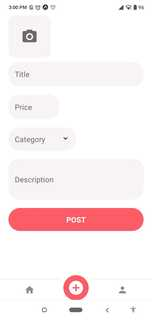

# Done With It (mobile app)

#### Done With It is a market place to sell stuff you don't need anymore.

 
 

 
 

#### Features
- basic authentication
- Post method implementation, submit a form
- Get method implementation, display list of products
- Fetch data from API
- Animations
- run in Android and IOS devices

#### Livedemo
- [staging channel](https://expo.io/@cecipeke/projects/DoneWithIt?release-channel=staging)

## Getting started
- once you have the backend running
- run `npm install`;
- run `npm start`

## Author
👤 [Cecilia Benitez](https://ceciliabenitez.com/)

## Contributing

Contributions, issues and feature requests are welcome!

Feel free to check the [issues page](https://github.com/Ceci007/done-with-it/issues)

## Show your support

Give a star if you like this project!

## 📝 License

This project is MIT licensed.
